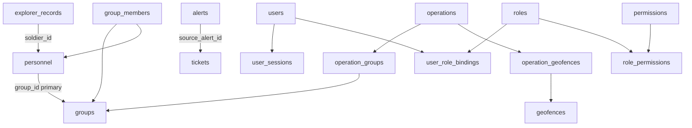
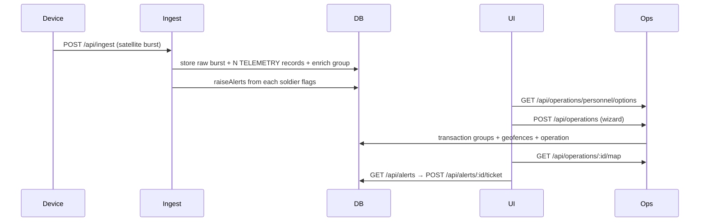

# TrackForge / SYNAPSE-T Backend

NestJS backend untuk platform tracking personel lapangan (LoRa mesh telemetry), alert, ticket, geofence, operations, dan user access.

Repo: [adzka29/be-iot](https://github.com/adzka29/be-iot)  
Stack: **NestJS 11 · better-sqlite3 · TypeORM stubs · Jest e2e**

---

## Daftar isi

1. [Ringkasan produk](#1-ringkasan-produk)
2. [Quick start](#2-quick-start)
3. [Arsitektur](#3-arsitektur)
4. [Environment](#4-environment)
5. [Autentikasi & permission](#5-autentikasi--permission)
6. [Model data](#6-model-data)
7. [Data seed awal](#7-data-seed-awal)
8. [Fitur & API](#8-fitur--api)
9. [Telemetry & mesh wire format](#9-telemetry--mesh-wire-format)
10. [Personnel & group enrichment](#10-personnel--group-enrichment)
11. [Operations wizard](#11-operations-wizard)
12. [Alur end-to-end](#12-alur-end-to-end)
13. [Testing](#13-testing)
14. [Catatan FE](#14-catatan-integrasi-frontend)
15. [Riwayat evolusi](#15-riwayat-evolusi)

Dokumentasi API mendalam per domain: [`docs/BACKEND.md`](docs/BACKEND.md).

---

## 1. Ringkasan produk

Backend ini menerima paket telemetry dari perangkat lapangan, menyimpannya sebagai *explorer records*, menurunkan *alerts* dari flag sensor, dan mengekspos API operasional untuk:

| Domain | Fungsi |
|--------|--------|
| **Ingest** | `POST /api/ingest` satellite burst → N× TELEMETRY (+ burst audit) |
| **Explorer** | Universal search/inspect business records (sekarang soldier TELEMETRY) |
| **Alerts** | SOS/severity dari `flags` + `source_record_id` → telemetry |
| **History** | Chronological telemetry / track (baca `explorer_records` yang sama) |
| **Geofences** | Polygon zona (silent) |
| **Personnel / Groups** | Master roster + group (session + permission; bukan dari wire) |
| **Operations** | Group + assignment, lifecycle, map, wizard create |
| **Tickets** | Ticket dari alert: assign, collaborate, task, resolve |
| **Users / Roles / Bindings** | Human users, role catalog, 1 binding aktif per user |
| **Profile / Audit** | `auth/me`, profile image, activity log (CREATE/UPDATE/ACK…) |

Nama produk di UI sering disebut **SYNAPSE-T**; nama package/repo tetap **trackforge-backend**.

---

## 2. Quick start

### Prasyarat

- Node.js **18+** (disarankan LTS; native module `better-sqlite3` harus compile di environment Anda)
- npm

### Install & run

```bash
npm install
npm run start:dev
```

Server default: `http://0.0.0.0:8000`

| Endpoint | Keterangan |
|----------|------------|
| `GET /health` | Health check |
| `GET /openapi.json` | OpenAPI stub (jika diaktifkan) |

### Login seed

```http
POST /users/login
Content-Type: application/json

{ "account": "superadmin", "password": "superadmin" }
```

Response berisi `session_id`. Semua API yang butuh auth:

```http
Authorization: Bearer <session_id>
```

Alternatif header: `X-Session-Id: <session_id>`.

### Build production

```bash
npm run build
npm run start:prod
```

Deploy start command (Railpack): `node dist/main.js`.

---

## 3. Arsitektur

```
Client / Gateway
      │
      ▼
 NestJS Controllers  ──►  Services / Controllers logic
      │
      ▼
 Repository helpers (operations) + DatabaseService (better-sqlite3)
      │
      ▼
 SQLite  (data/trackforge.db)
```

### Layering

| Layer | Peran |
|-------|--------|
| `*.controller.ts` | HTTP routes, query/body |
| `*.service.ts` / logic di controller | Validasi bisnis, permission, audit |
| `operations.repository.ts` | Query SQL khusus operations |
| `DatabaseService` | Init schema, seed, insert explorer records |
| TypeORM entities | Stub metadata saja — **schema dimiliki** `initDb()` |

### Modul Nest (`src/app.module.ts`)

`Database` · `Health` · `Ingest` · `Explorer` · `Alerts` · `History` · `Geofences` · `Personnel` · `Users` · `Profile` · `Roles` · `Bindings` · `Audit` · `Tickets` · `Operations`

### Pola penting

- **SQLite sinkron** via `better-sqlite3` (bukan pool async TypeORM untuk query runtime).
- **Ingest tidak butuh session** (endpoint perangkat).
- **Operations / tickets / users** memakai Bearer session + cek domain permission.
- Soft-delete operations: `deleted_at` diisi, record tidak ikut list/detail.

---

## 4. Environment

| Variabel | Default | Fungsi |
|----------|---------|--------|
| `PORT` | `8000` | HTTP listen port |
| `TRACKFORGE_DB` | lihat di bawah | Path file SQLite |
| `TRACKFORGE_SEED` | on (kecuali `"0"`) | Unified telemetry seed + access |
| `TRACKFORGE_SEED_HOURS` | `24` | Durasi seed (24 → 43.200 TELEMETRY sebelum gap) |
| `TRACKFORGE_SEED_BASE` | *(now − duration)* | Awal window seed; kosong = berakhir di jam wall-clock sekarang |
| `TRACKFORGE_LIVE_SIM` | on (kecuali `"0"`) | Lanjut generate tiap **30 detik** (30 record/menit) dengan jam aktual |

Urutan resolusi path DB:

1. `TRACKFORGE_DB` jika di-set  
2. else `$RAILWAY_VOLUME_MOUNT_PATH/trackforge.db` (Volume Railway)  
3. else `<cwd>/data/trackforge.db` (local)

Contoh test: `TRACKFORGE_SEED_BASE=2026-10-04T08:00:00Z`, `TRACKFORGE_SEED_HOURS=0.75`, `TRACKFORGE_LIVE_SIM=0`.

### Deploy Railway (supaya data tidak hilang tiap deploy)

Tanpa Volume, SQLite di container **terhapus** setiap redeploy → seed ulang → data beda dengan local.

1. Railway → Service → **Settings → Volumes** → Add Volume  
   - Mount path: `/data`  
2. Variables (recommended):

| Variable | Value |
|----------|--------|
| `TRACKFORGE_DB` | `/data/trackforge.db` |
| `TRACKFORGE_SEED_HOURS` | `24` |
| `TRACKFORGE_LIVE_SIM` | `1` (atau `0` jika ingin freeze setelah seed) |
| `TRACKFORGE_SEED_BASE` | *(opsional)* ISO fixed, mis. `2026-10-04T08:00:00Z` |

3. Redeploy. Cek log: `[DatabaseService] SQLite path: /data/trackforge.db`  
4. Seed hanya jalan **sekali** saat DB volume masih kosong. Deploy berikutnya memakai data yang sama (operations/groups yang dibuat di Railway tetap ada).

Lihat juga `.env.example` dan `railway.toml`.

---

## 5. Autentikasi & permission

### Session

1. `POST /users/login` → `session_id` (simpan di `user_sessions`, expiry 7 hari).
2. Request berikutnya: `Authorization: Bearer <session_id>`.
3. `POST /users/logout` invalidasi session.

### Permission model

Catalog domain (`src/database/access.ts`):

`overview` · `groups` · `personal` · `weapons` · `operations` · `geofences` · `explorer` · `alerts` · `history` · `reports` · `lora_mesh` · `gateways` · `user_access` · `activity_log` · `settings`

Tiap domain punya:

- `<domain>` → full (write + read)
- `<domain>.read` → read only

### Role seed

| Role | Ringkas |
|------|---------|
| `superadmin` | Semua domain |
| `operations commander` | Operational + baca mesh/gateway/audit |
| `operations officer` | Workflow operasional harian |
| `field operator` | Read monitoring lapangan |
| `device & fleet admin` | LoRa mesh + gateways |
| `viewer` | Semua operational domain `.read` |

Binding: **satu role aktif per user** (`user_role_bindings.UNIQUE(user_id)`).

### Akun seed

| Field | Nilai |
|-------|--------|
| Username | `superadmin` |
| Email | `superadmin@trackforge.id` |
| Password | `superadmin` |
| Role | `superadmin` |

---

## 6. Model data

### Diagram hubungan inti



### Tabel utama

| Tabel | Isi |
|-------|-----|
| `explorer_records` | Semua event telemetry / beacon / system |
| `alerts` | Alert turunan dari flag / no-contact |
| `geofences` | Zona polygon + `kind`/`color` opsional |
| `groups` | Squad/unit; `leader_soldier_id` |
| `personnel` | Master soldier_id → name → primary `group_id` |
| `group_members` | Membership many-to-many group↔soldier |
| `operations` | Misi; code `OP-YYYY-NNN`; status lifecycle |
| `operation_groups` / `operation_geofences` | Link misi |
| `tickets` (+ collaborators, tasks, updates) | Workflow dari alert |
| `users` / `roles` / `permissions` / bindings / sessions | Access control |
| `audit_logs` | Jejak aktivitas |

### Status operasi

`PLANNING` → `ACTIVE` ⇄ `ON_HOLD` → `COMPLETED`  
juga: `CANCELLED` dari PLANNING/ACTIVE/ON_HOLD

**Delete** diizinkan hanya: `PLANNING` | `COMPLETED` | `CANCELLED`  
Ditolak (409): `ACTIVE` | `ON_HOLD`

Create selalu memaksa status **`PLANNING`** (field `status` di body ditolak).

---

## 7. Data seed awal

Saat DB kosong dan `TRACKFORGE_SEED != "0"`:

### Personnel / Groups

- **Tidak di-seed** (`seedPersonnelMaster` no-op — hindari fabricated identity).
- Settings Groups mulai kosong; isi lewat **Operations wizard** atau API Groups/Personnel (ber-session).
- Konsekuensi: seed TELEMETRY punya `soldier_id`, tapi `personnel_name` / `group_id` sering **null** sampai master diisi.

### Explorer + Alerts + History (unified)

- Satu seed **TELEMETRY** unified: **15 soldiers**, **2 paket/menit/soldier** (setiap 30 detik) → **43.200 / 24 jam** (default `TRACKFORGE_SEED_HOURS=24`)
- Envelope `UPLINK`/`SATELLITE_BURST` = **transport/audit internal** saja (bukan domain FE Explorer)
- Alerts dari `raiseAlerts()` + bounded flag windows + 1× NO_CONTACT dari gap nyata S-115; `source_record_id` wajib (0 orphan)
- History = chronological view atas TELEMETRY yang sama (bukan tabel terpisah)
- SOS: `flags.sos` di TELEMETRY (S-104) → Explorer + Alert + History
- Retention 30 hari (telemetry / burst audit / alerts); live simulator lanjut 30 record/menit (`TRACKFORGE_LIVE_SIM=0` di test)

### Access

- Permission catalog semua domain
- 6 role seed + superadmin user + binding aktif

Matikan seed: `TRACKFORGE_SEED=0`.

---

## 8. Fitur & API

Ringkasan path (detail request/response di [`docs/BACKEND.md`](docs/BACKEND.md)).

### Health

- `GET /health`

### Auth / Users

- `POST /users/login` · `POST /users/logout`
- `POST /users/human` · `GET /users` · `GET /users/summary`
- `GET /users/:id/permissions` · `PATCH /users/:id/human`

### Profile

- `GET /auth/me`
- `PATCH /users/me`
- `GET|DELETE /users/me/profile-image`

### Roles & bindings

- `GET|POST /roles` · `GET /roles/summary` · `GET|PUT|DELETE /roles/:id...`
- `GET|POST /user-roles` · `PATCH /user-roles/:id/status`

### Ingest — satu endpoint (device auth ≠ user session)

- `POST /api/ingest` — satellite burst (`6-byte header + N×21-byte` soldier payloads)
- Prototype/local: tanpa user session
- Production: wajib gateway/device credential (API key / HMAC / mTLS) — jangan treat sebagai public internet open write

### Explorer / Alerts / History

- `GET /api/explorer` · `summary` · `filters/options` · `export.csv` · `:id`
  - Filter FE utama: `q`, `soldier_id`, `from_time`, `to_time`, `timeRange`, `limit`, `offset`
  - Bukan filter utama: Group / Status / Severity / Alert; transport hanya debug (`include_transport=1`)
- `GET /api/alerts` · `summary` · `sos` · acknowledge/resolve · export — Bearer + `alerts` (GET = read; ack/resolve = write; actor dari session; GET read-only, `syncNoContact` di ingest/sim)
- `GET /api/history` · `track` · `statistics` · `charts` · export

### Geofences

- `GET|POST /api/geofences` · `DELETE /api/geofences/:id`

### Personnel & Groups (session + permission)

- GET groups → `groups` read · POST/PATCH → `groups` write
- GET personnel → `personal` read · POST/PATCH → `personal` write
- `PUT /api/personnel/by-soldier/:soldierId/group` → `personal` + `groups` write

### Operations

- List/summary/filters/options/groups/options/**personnel/options**
- CRUD + lifecycle activate/hold/resume/complete/cancel
- Nested groups/geofences/personnel/map/alerts/tickets
- Wizard create: lihat [§11](#11-operations-wizard)

### Tickets

- `GET|POST /api/tickets` · detail · assign · start-working · waiting · resolve · close
- Collaborators / tasks / updates
- `POST /api/alerts/:alertId/ticket` — buat ticket dari alert

### Audit

- `GET /audit-logs` · summary · categories · export · me · `:eventId`
- `POST /audit-logs` · `DELETE /audit-logs/:eventId`

---

## 9. Telemetry & mesh wire format

### Soldier payload (21 byte)

Dipakai di `telemetry` JSON dan di dalam mesh frame:

| Field | Keterangan |
|-------|------------|
| soldier_id | ID personel perangkat |
| seq | Sequence |
| timestamp | Unix time |
| lat / lon | Posisi |
| hr / hrv / spo2 / temp / batt | Sensor |
| flags | Bitfield: SOS, casualty, arrhythmia, position source, strap, low battery, heat stress |

**Tidak ada `group_id` di wire.** Group diisi server dari Personnel master saat ingest (`resolveGroupName`).

### Mesh frame

Ingress cloud: `POST /api/ingest` dengan satellite burst (header 6 byte + N×21-byte payload). Mesh-frame adalah transport lapangan internal, bukan API publik backend.

Setelah tiap soldier record tersimpan, `raiseAlerts()` mengevaluasi flag → buka/update alert.

---

## 10. Personnel & group enrichment

```
Wire packet (soldier_id + sensors)
        │
        ▼
  lookup personnel (no invent)
        │
        ▼
  group_id TEXT di explorer_records = nama group (mis. "Alpha") or null
```

- **Primary group**: `personnel.group_id`
- **Membership multi**: `group_members` (dipakai operations map/personnel count)
- Saat assign anggota (wizard / `setGroupMembers`): sync `group_members` **dan** `personnel.group_id`
- Soldier ID bisa dinormalisasi: `"S-103"` → `103`

Ini menjaga format perangkat tetap stabil sambil organisasi group bisa diubah di BE/UI.

---

## 11. Operations wizard

Satu `POST /api/operations` untuk Review & Create:

```json
{
  "name": "Operation Alpha",
  "description": "...",
  "start_at": "2026-10-06T08:00:00Z",
  "end_at": "2026-10-09T18:00:00Z",
  "type": "Reconnaissance",
  "group_ids": [1],
  "groups": [{
    "name": "Example Group",
    "leader_soldier_id": "<existing-soldier-id>",
    "member_soldier_ids": ["<existing-soldier-id>"]
  }],
  "geofence_ids": [1],
  "new_geofences": [{
    "name": "New Zone",
    "kind": "recon",
    "color": "#F2A900",
    "polygon": [[106.82, -6.22], [106.83, -6.22], [106.825, -6.23]],
    "area_km2": 0.3
  }]
}
```

- Validasi: `end_at > start_at`, name wajib, soldier id normalize
- **Satu transaksi SQLite**: insert operation → link/create groups+members → link/create geofences
- Response = detail + `type` + `leader_soldier_id` + `personnel_count`
- Helper roster Step 2: `GET /api/operations/personnel/options?q=`
- Nested add tetap bisa: `POST .../groups` atau `.../geofences` dengan id **atau** body inline

Kompatibel: body lama hanya `group_ids` + `geofence_ids` tetap valid.

---

## 12. Alur end-to-end



1. Perangkat kirim telemetry → tersimpan + alert jika flag aktif.  
2. Operator login → buat operasi (wizard atau link existing).  
3. Map/personnel/alerts/tickets di-scope lewat group anggota operasi.  
4. Alert kritis → ticket → assign/resolve/close.  
5. Lifecycle operasi: activate → (hold/resume) → complete/cancel.

---

## 13. Testing

```bash
npm test                 # semua e2e (runInBand)
npm run test:e2e
```

Suite utama:

| File | Cakupan |
|------|---------|
| `test/api.e2e-spec.ts` | Ingest, explorer, alerts, users, seed |
| `test/operations.e2e-spec.ts` | Lifecycle, wizard, delete rules |
| `test/personnel.e2e-spec.ts` | Master personnel/groups |
| `test/tickets.e2e-spec.ts` | Ticket workflow |
| `test/profile.e2e-spec.ts` | Profile / me |

Setiap test memakai DB sementara (tidak menyentuh `data/trackforge.db` lokal).

---

## 14. Catatan integrasi frontend

1. **Auth**: simpan `session_id`, kirim Bearer di setiap call protected (termasuk Groups/Personnel).  
2. **Permission**: gunakan `GET /auth/me` untuk hide/disable menu — BE tetap enforce.  
3. **Pemisahan menu**: Explorer = inspect records; Operations = group/assignment; Prajurit = status personel; Alerts = severity; History = track; Audit = action log.  
4. **Explorer filters**: `q`, `soldier_id`, time (`from_time`/`to_time`/`timeRange`), `limit`/`offset`. Jangan hidupkan filter Group/UPLINK/MESH di default FE.  
5. **History**: Bearer + `history` read; wajib `scope=SOLDIER|GROUP`; default **TELEMETRY only**; `group_id` = nama group di telemetry (boleh kosong tanpa enrichment).  
6. **SOS**: `flags.sos` di TELEMETRY — tampil di Explorer & History; alert terpisah di Alerts.  
7. **Operations wizard**: roster → `personnel/options`; Review → `POST /api/operations` dengan `groups[]` + `new_geofences[]`; Map → `.../map`.  
8. **Group**: tidak ada di wire packet; enrichment dari Personnel master (boleh null jika master kosong).  
9. **IDs**: numeric (`operations.id`); tampilkan `operation_code` ke user. Jangan mengarang Danru/soldier identity di contoh.  
10. Error shape: HTTP status + detail (`DetailExceptionFilter`).

---

## 15. Riwayat evolusi

| Tahap | Isi |
|-------|-----|
| Awal | FastAPI + SQLite TrackForge |
| Migrasi | Port penuh ke NestJS, API-compatible |
| Access | Roles/bindings/permissions; matrix endpoint dihapus |
| Tickets | Alert-backed tickets + collaborators/tasks |
| Operations V1 | Link existing groups/geofences + lifecycle |
| Personnel master | Table `personnel` + enrich ingest tanpa group di wire |
| Operations Wizard | `group_members`, inline create group/geofence, type/kind/color, delete rules V1 |
| Satellite ingest | Satu `POST /api/ingest` (burst); legacy ingest routes dihapus |
| Unified seed | TELEMETRY → Explorer + `raiseAlerts` + History (satu dataset) |

---

## Skrip npm

| Script | Fungsi |
|--------|--------|
| `npm run start:dev` | Watch mode |
| `npm run build` | Compile ke `dist/` |
| `npm run start:prod` | Jalankan `dist/main` |
| `npm test` | Jest e2e in-band |

---

## Lisensi

`UNLICENSED` (private).
